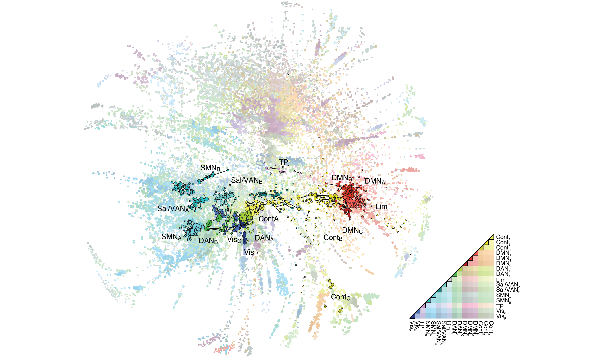

# edge-centric_demo

Demo code repository for [Faskowitz, J., Esfahlani, F. Z., Jo, Y., Sporns, O., & Betzel, R. F. (2020). Edge-centric functional network representations of human cerebral cortex reveal overlapping system-level architecture.](https://doi.org/10.1038/s41593-020-00719-y) In `example_code.m` you can find calls for:
* edge time series (`fcn_edgets.m`)
* edge functional connectivity (eFC) (`fcn_edgets2edgecorr.m`)
* community overlap entropy (`fcn_node_entropy.m`)
* edge community similarity (`fcn_profilesim.m`)

Furthermore, the script will output simple visualizations of the example data. 

---

Edge time series are a frame-by-frame account of the co-fluctuation between nodes. These time series come from an intermediate step in the Pearson correlation calcuation. By taking the similarity between all pairs of edge time series, we can obtain an edge-by-edge matrix (eFC). Network operations applied to the eFC matrix describe the interrelationships between edges, and can be mapped to the node by node space. Community detection on the edge information results in overlapping clusters at the node level. The overlap at each node can be taken using entropy. Given the numerous clusters affliated with each node, we can calcuate which nodes share similar edge community profies. 

Here we visualize some of the strongest links in eFC matrix, and highlight edge-edge relationships that fall within the canonical Yeo systems. Edges that fall between systems are colored via interpolation of system colors.

 This material is based upon work supported (in part) by the National Science Foundation Graduate Research Fellowship under Grant No. 1342962. Any opinion, findings, and conclusions or recommendations expressed in this material are those of the authors(s) and do not necessarily reflect the views of the National Science Foundation. 
